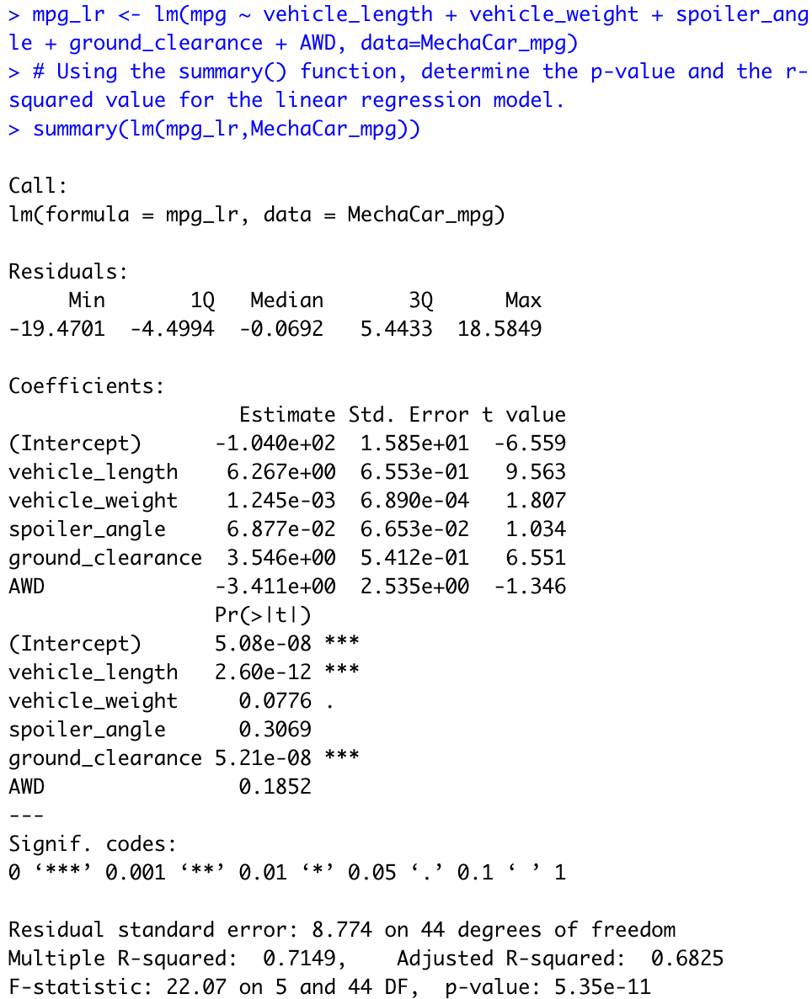
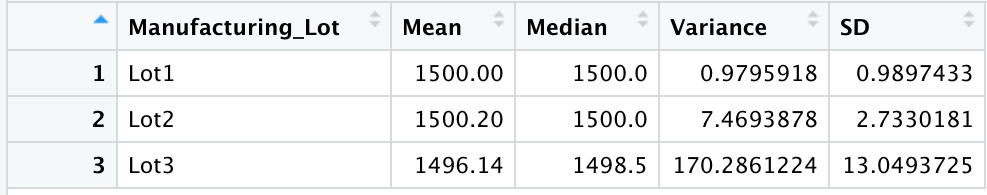
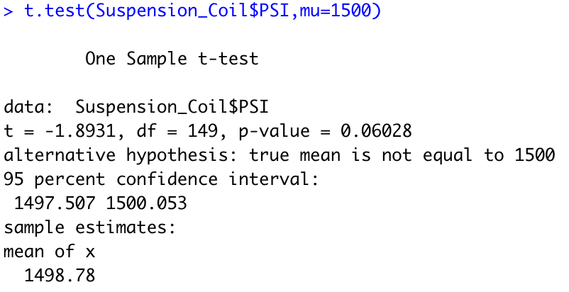
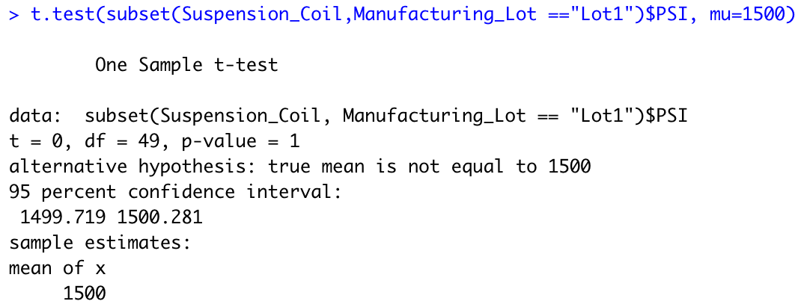
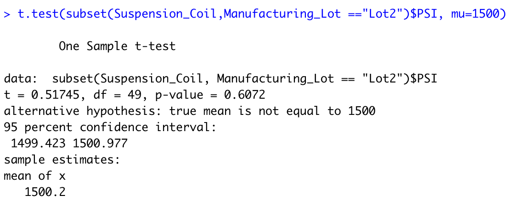
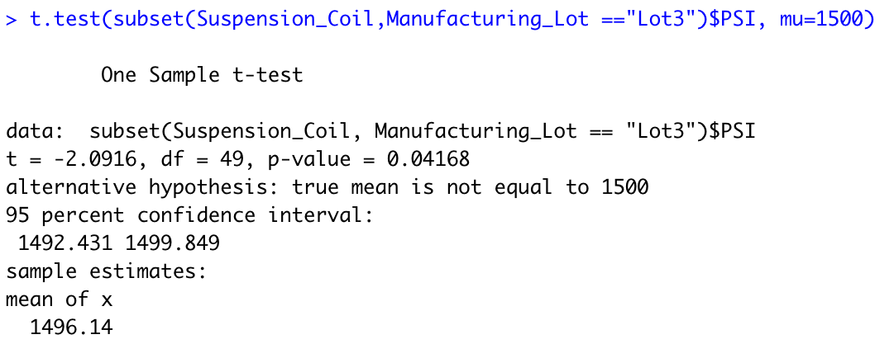

# MechaCar Statistical Analysis

## Overview of Project

### Purpose

The purpose of this analysis is to review MechaCar production data for insights on mpg predictions, summary statistics,

Perform multiple linear regression analysis to identify which variables in the dataset predict the mpg of MechaCar prototypes
Collect summary statistics on the pounds per square inch (PSI) of the suspension coils from the manufacturing lots
Run t-tests to determine if the manufacturing lots are statistically different from the mean population
Design a statistical study to compare vehicle performance of the MechaCar vehicles against vehicles from other manufacturers. For each statistical analysis, you’ll write a summary interpretation of the findings.

## Linear Regression to Predict MPG

### Which variables/coefficients provided a non-random amount of variance to the mpg values in the dataset?

### Is the slope of the linear model considered to be zero? Why or why not?
The p-value of our linear regression analysis is 5.35 x 10-7, which is much smaller than our assumed significance level of 0.05%. Therefore, the slope of our linear model is not zero.

### Does this linear model predict mpg of MechaCar prototypes effectively? Why or why not?
From our linear regression model, the r-squared value is 0.7149, which means that roughly 71% of mpg data is explained using this linear model. This is a fairly effective prediction but means other variables should be considered.

## Summary Statistics on Suspension Coils

### The design specifications for the MechaCar suspension coils dictate that the variance of the suspension coils must not exceed 100 pounds per square inch. Does the current manufacturing data meet this design specification for all manufacturing lots in total and each lot individually? Why or why not?

## T-Tests on Suspension Coils

### Briefly summarize your interpretation and findings for the t-test results. Include screenshots of the t-test to support your summary.

## Study Design: MechaCar vs Competition.
Write a short description of a statistical study that can quantify how the MechaCar performs against the competition. In your study design, think critically about what metrics would be of interest to a consumer: for a few examples, cost, city or highway fuel efficiency, horse power, maintenance cost, or safety rating.
In your description, address the following questions:
### What metric or metrics are you going to test?
### What is the null hypothesis or alternative hypothesis?
### What statistical test would you use to test the hypothesis? And why?
### What data is needed to run the statistical test?